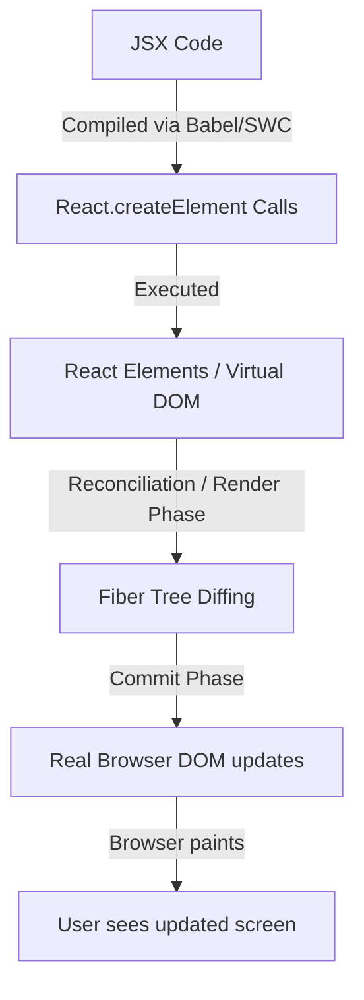

# React Mastery Guide: From Zero to Interview-Ready

Welcome! This guide is designed to take you from a basic understanding of HTML, CSS, and JavaScript to a deep, interview-ready mastery of React. Instead of dry theory, we will learn React by looking directly at the codebase of your AI Engineer Portfolio website.

---

## 1. Why React Exists & What It Solves

### Definition
React is a declarative, component-based JavaScript library for building user interfaces. It was created by Facebook (Meta) to solve the difficulty of managing fast-changing UI states in complex web applications.

### Mental Model: The Old Way vs. React Way
- **The Old Way (Imperative)**: You write instructions telling the browser *how* to change the page step-by-step.
  *Example*: "Find the button. Listen for a click. When clicked, find the div. Change its text to 'Hello'. Add a class called 'active'."
  *Problem*: As your app grows, keeping track of every manual DOM update becomes a nightmare. If you forget to update one element, your UI gets out of sync with your application data.
- **The React Way (Declarative)**: You describe *what* the UI should look like based on the current state.
  *Example*: "If `isOpen` is true, render a modal with class 'active'. Otherwise, render nothing."
  *Solution*: When data (state) changes, React automatically figures out how to update the browser's DOM to match your description.

### Interview Questions & Strong Answers
- **Question**: Why would you choose React over vanilla JavaScript for a large project?
  *Why Interviewers Ask*: To see if you understand the core value proposition of React beyond "it's popular."
  *Ideal Answer*: "React solves the problem of DOM synchronization. In vanilla JavaScript, managing state changes requires manual, imperative DOM manipulation, which is error-prone and slow. React introduces a declarative programming model where the UI is a direct function of state (`UI = f(State)`). By using components, it enforces modularity and code reuse, while its Virtual DOM and reconciliation engine ensure that updates are performed efficiently behind the scenes."
  *Weak Answer*: "React is faster and it's what everyone uses now."

---

## 2. Components

### Definition
A React component is a self-contained, reusable block of code that describes a piece of the user interface. In modern React, components are written as JavaScript functions that return JSX.

### Mental Model
Think of components as custom HTML tags. Just as `<button>` is a built-in browser component, you can define `<Navbar />` or `<ProjectCard />` to represent custom, complex UI pieces.

### Simple Example
```javascript
function WelcomeMessage() {
  return <h1>Hello, Welcome to my Portfolio!</h1>;
}
```

### In Our Project
Look at [Navbar.tsx](file:///c:/Users/malik/Desktop/DigitalHub/Responsive-Design/artifacts/portfolio/src/components/Navbar.tsx#L15):
```typescript
export function Navbar() {
  // state and hooks here...
  return (
    <nav className="...">
      {/* Navbar UI structure */}
    </nav>
  );
}
```
This is a functional component. It encapsulates navigation link logic, mobile menu toggling, and styling.

### Common Mistakes
- **Capitalization**: Forgetting to capitalize the component name. React treats lowercase tags (like `<div>` or `nav`) as native HTML tags, and capitalized tags (like `Navbar`) as custom components.

### Interview Questions & Strong Answers
- **Question**: What is the difference between Functional Components and Class Components?
  *Why Interviewers Ask*: To check your knowledge of React's evolution.
  *Ideal Answer*: "Historically, Class Components were used to manage state and lifecycle methods. Functional Components were simple 'stateless' presenters. With the introduction of React Hooks in version 16.8, Functional Components gained full state management and lifecycle capabilities. Today, Functional Components are the industry standard because they require less boilerplate, are easier to test, and promote better code composition."
  *Weak Answer*: "Functional components use functions, class components use classes, and functional ones are better."

---

## 3. JSX (JavaScript XML)

### Definition
JSX is a syntax extension for JavaScript that looks like HTML. It allows you to write HTML-like structures directly inside your JavaScript files.

### Mental Model
JSX is syntactic sugar. Browsers do not understand JSX. Under the hood, a compiler (like Babel or SWC) converts JSX code into standard JavaScript objects representing React elements.

### Simple Example
```javascript
const element = <h1 className="title">Hello World</h1>;
// Compiles to:
// const element = React.createElement('h1', { className: 'title' }, 'Hello World');
```

### Common Mistakes
- **`class` vs `className`**: In HTML, you write `<div class="container">`. In JSX, because `class` is a reserved keyword in JavaScript, you must write `<div className="container">`.
- **Single Root Element**: JSX must return a single root element. You cannot return two adjacent tags unless they are wrapped in a container or a Fragment (`<>` and `</>`).

### In Our Project
Look at [Navbar.tsx](file:///c:/Users/malik/Desktop/DigitalHub/Responsive-Design/artifacts/portfolio/src/components/Navbar.tsx#L45-L51):
```typescript
<a 
  href="#hero" 
  onClick={(e) => handleNavClick(e, "#hero")}
  className="text-2xl font-bold tracking-tighter text-primary"
>
  MH<span className="text-foreground">.</span>
</a>
```
Here, we embed standard HTML elements (`a`, `span`), attributes (`href`, `className`), and dynamic JavaScript handlers (`onClick`) in a cohesive JSX element.

---

## 4. Props (Properties)

### Definition
Props are read-only inputs passed into a React component from its parent component. They are how components receive data and configure themselves.

### Mental Model
Think of props like arguments passed to a function, or attributes on an HTML tag (like `src` in ``).

### Simple Example
```javascript
function Greeting(props) {
  return <h1>Hello, my name is {props.name}!</h1>;
}

// In parent:
<Greeting name="Malik" />
```

### In Our Project
Look at [ProjectCard.tsx](file:///c:/Users/malik/Desktop/DigitalHub/Responsive-Design/artifacts/portfolio/src/components/ProjectCard.tsx#L12-L17):
```typescript
interface ProjectCardProps {
  title: string;
  description: string;
  technologies: string[];
  achievements: string[];
  architecture: string;
  githubUrl?: string;
  liveDemoUrl?: string;
}

export function ProjectCard({ title, description, ... }: ProjectCardProps) { ... }
```
Here, we use TypeScript to define the shape of `props`. The parent component `Projects.tsx` loops through the list of projects and passes each project's data into the `ProjectCard` as props.

### Common Mistakes
- **Mutating Props**: Attempting to change a prop value inside a child component. Props must remain immutable. If a child needs to modify data, the parent should pass down a function to update state.

---

## 5. State

### Definition
State is an object that holds data local to a component that can change over time. When state changes, React schedules a re-render of the component and its children to update the browser UI.

### Mental Model
If props are like parameters passed *into* a function, state is like local variables declared *inside* a function—but with a special superpower: changing them triggers an automatic UI redraw.

### In Our Project
Look at [Navbar.tsx](file:///c:/Users/malik/Desktop/DigitalHub/Responsive-Design/artifacts/portfolio/src/components/Navbar.tsx#L16-L17):
```typescript
const [isScrolled, setIsScrolled] = useState(false);
const [mobileMenuOpen, setMobileMenuOpen] = useState(false);
```
Here:
- `isScrolled` tracks whether the user has scrolled down the page (used to style the sticky header).
- `mobileMenuOpen` tracks whether the mobile slide-down menu is visible.

### Common Mistakes
- **Direct Mutation**: Writing `state = true` instead of calling the updater function `setState(true)`. Direct mutations do not notify React that state has changed, so the UI will not update.

---

## 6. Rendering & Re-rendering

### Definition
- **Render**: The process of React executing your component functions, generating virtual elements (JSX), and calculating the virtual representation of your UI.
- **Re-render**: Triggered by a change in state or props. React runs the component function again with the new values.

### Render Trigger Flow
```
State/Props Change ──> React triggers Re-render ──> Executes Component Function ──> Compares output ──> Updates DOM
```

### Interview Questions & Strong Answers
- **Question**: What triggers a React component to re-render?
  *Ideal Answer*: "A component re-renders under three main conditions:
  1. A change in its local state (via a `setState` or hook update).
  2. A change in the props passed down by its parent component.
  3. The re-rendering of its parent component (unless the child is optimized using `React.memo`)."

---

## 7. Virtual DOM & Reconciliation

### Definition
- **Virtual DOM (VDOM)**: A lightweight, in-memory copy of the real HTML DOM.
- **Reconciliation**: The algorithm React uses to compare the new Virtual DOM with the old one (called "diffing") and compute the minimal set of changes needed to update the real browser DOM.

### Mental Model
Imagine you edit a single sentence in a 100-page document. Instead of throwing away the entire book and printing it again (which is slow, like rebuilding the entire real DOM), you mark that sentence, find it on the page, and swap it (fast, like React updating only the changed element).

### Interview Questions & Strong Answers
- **Question**: Why is the Virtual DOM fast?
  *Ideal Answer*: "Actually, the Virtual DOM itself isn't necessarily faster than direct DOM writes for small changes, but it provides a abstraction layer that makes scale manageable. The real DOM operations are slow because modifying elements forces the browser to recalculate the page layout and paint pixels. React batches changes and computes a diff between VDOM states, meaning it only updates the exact real DOM nodes that changed, reducing reflows and repaints."

---

## 8. React Hooks

Hooks are special functions that allow you to "hook into" React state and lifecycle features from functional components.

### Hook Rules
1. **Only call hooks at the top level**: Do not call hooks inside loops, conditions, or nested functions. This ensures React executes hooks in the exact same order every render.
2. **Only call hooks from React functions**: Call them from React functional components or custom hooks.

---

### useState
- **Purpose**: Adds local state to a component.
- **Example in Project**: In `useTheme.ts`, we initialize the theme state:
  ```typescript
  const [theme, setTheme] = useState<'light' | 'dark'>(() => { ... });
  ```

---

### useEffect
- **Purpose**: Performs side effects (data fetching, subscriptions, manual DOM manipulation, scroll event listeners) in functional components.
- **Example in Project**: In `Navbar.tsx`, we register and clean up a scroll listener:
  ```typescript
  useEffect(() => {
    const handleScroll = () => {
      setIsScrolled(window.scrollY > 20);
    };
    window.addEventListener("scroll", handleScroll);
    return () => window.removeEventListener("scroll", handleScroll);
  }, []);
  ```
  *Mental Model*: The empty dependency array `[]` means this effect runs once when the component mounts. The return function is a **cleanup function** that runs when the component unmounts, preventing memory leaks.

---

### useRef
- **Purpose**: Creates a mutable object whose `.current` property persists across renders. Crucially, updating a ref does *not* trigger a re-render. It is also used to reference DOM nodes directly.
- **Mental Model**: A storage box inside your component that you can put values in without triggering a reload of the UI.
- **Interview Question**: How does `useRef` differ from `useState`?
  *Ideal Answer*: "Both persist values across renders. However, updating a `useState` variable triggers a component re-render, whereas updating the `.current` property of a `useRef` object does not. `useRef` is ideal for storing instance variables, timer IDs, or referencing DOM elements directly."

---

### useMemo & useCallback
- **useMemo**: Memoizes (caches) the *result* of a calculation.
- **useCallback**: Memoizes a *function definition* itself.
- **Mental Model**: Caching mechanisms. Avoid doing heavy work or rebuilding function instances on every render unless their dependencies change.

---

## 9. Context API

### Definition
The Context API is a mechanism that allows you to share state or values across your entire component tree without manually passing props down through every single level (a problem known as "prop drilling").

### Mental Model
Think of Context like a local radio tower. Instead of handing a letter from parent to child to grandchild (prop drilling), the parent broadcasts a signal, and any descendant component can tune in and read the signal directly.

---

## 10. How React Works Behind the Scenes (Fiber Architecture)

Below is an overview of how React compile and paint cycles operate under the hood:

### The Render Cycle
1. **JSX Compilation**: Transpilers (like Babel or SWC) translate JSX into nested `React.createElement(...)` calls.
2. **Virtual Elements**: Executing `createElement` returns pure JS objects representing the UI node structure.
3. **Fiber Nodes**: React maps elements to a internal node tree called the **Fiber tree**. Each "Fiber" is a unit of work.
4. **Reconciliation (Render Phase)**: React traverses the Fiber tree, diffs changes, and builds a list of DOM modifications (effect list). This phase is asynchronous and can be paused or split.
5. **Commit Phase**: React applies the changes to the real browser DOM synchronously in a single batch.



### React Fiber
Introduced in React 16, **Fiber** is a complete rewrite of the core reconciliation engine. 
- In older React versions, reconciliation was recursive and blocking. If a page had complex updates, it could freeze the main browser thread, causing lag.
- Fiber breaks updates down into small "work units." It allows React to pause work, prioritize user interactions (like typing in a text field) over off-screen renderings, and resume work later.

---

## 11. Component-by-Component Analysis of Our Project

Here is how the React and styling concepts apply specifically to the components in your codebase:

### 1. `Navbar.tsx`
- **Location**: [Navbar.tsx](file:///c:/Users/malik/Desktop/DigitalHub/Responsive-Design/artifacts/portfolio/src/components/Navbar.tsx)
- **Role**: High-level structural component providing page navigation and theme control.
- **Interactive State**: `isScrolled` (boolean), `mobileMenuOpen` (boolean).
- **Hooks Used**: `useState` (state management), `useEffect` (attaching/cleaning up window scroll event listeners).

### 2. `ContactForm.tsx`
- **Location**: [ContactForm.tsx](file:///c:/Users/malik/Desktop/DigitalHub/Responsive-Design/artifacts/portfolio/src/components/ContactForm.tsx)
- **Role**: Collects user messages, performs client-side field validation, and provides dynamic success/error status messages.
- **Controlled state**: Uses standard inputs bound to state or handled via a form framework.

### 3. `useTheme.ts` (Custom Hook)
- **Location**: [useTheme.ts](file:///c:/Users/malik/Desktop/DigitalHub/Responsive-Design/artifacts/portfolio/src/hooks/useTheme.ts)
- **Role**: Manages dark/light styling preferences. Reads the theme configuration from `localStorage`, applies the matching class to `document.documentElement` for Tailwind dark utility configurations, and provides a toggle helper function.
